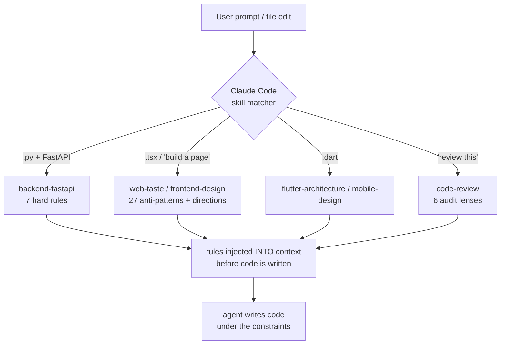

# haiclaudeskill — production engineering rules, injected into your AI coding agent

> A pack of **14 auto-triggering Claude Code skills** that load hard-won engineering rules into the agent's context *the moment they're relevant* — touch a FastAPI file and the multi-tenant / `Decimal`-money / async rules arrive **before** a line is written, not after a review finds the bug.
>
> The rules are distilled from a real ~60K-line FastAPI + Next.js + Flutter commerce codebase. The interesting part isn't the rules themselves — it's the **trigger precision** and **deterministic option-spaces** that make an agent's output reproducible instead of a dice roll.

---

## The problem

AI coding agents are confident and wrong. They reach for `float` on money, drop the tenant filter in a multi-tenant query, ship UI with no empty/error states, and invent APIs that don't exist. Plain prompt rules help, but they're easy to bury: a 200-line `CLAUDE.md` is in context for *every* task, so the rules that matter for *this* file get diluted by the 90% that don't.

These skills invert that. Each one carries a precise `description` front-matter that Claude Code matches against the **current file extension or the user's intent**, and loads only when relevant. The agent gets a focused rule-pack for the task in front of it — high signal, no dilution.

---

## Architecture



A skill is a markdown rule-pack plus front-matter. The front-matter's `description` is the whole game: it encodes an explicit **should-fire / should-NOT-fire** matrix that the matcher reads. `mobile-design` fires on `.dart`/`.swift`, never on web `.tsx`; `backend-fastapi` fires on FastAPI Python, never on Express or Django. Over-triggering poisons the context window as badly as under-triggering misses it — so trigger precision is treated as a first-class design constraint, not an afterthought.

---

## The interesting engineering

**1 · Trigger precision as a first-class concern.** The hard part of auto-trigger isn't firing — it's *not* firing on the wrong file. Every skill `description` carries a should-fire / should-NOT-fire matrix so the matcher loads the right pack and stays silent otherwise. This is what keeps the context window clean enough that the loaded rules actually get followed.

**2 · Deterministic option-spaces over "use your judgment."** Each design/quality skill hands the agent *N concrete options* — 5 visual directions, 7 render patterns, 6 audit lenses, 27 anti-patterns — instead of free-form latitude. Constraining the decision space is what makes agent output reproducible across runs rather than a roll of the dice.

**3 · Rules distilled from production, not from blog posts.** The backend and architecture rules (multi-tenant `shop_id` isolation on every query, `Decimal` money never `float`, atomic stock updates, order state-machine validation, async-everywhere) come from a real ~60K-line commerce platform. High signal density for that stack.

**4 · Portable by construction.** Skills reference `${CLAUDE_PLUGIN_ROOT}`, so the pack works on any machine after `/plugin install`. `install.sh` offers a symlink path that backs up any colliding skill to `~/.claude/skills.bak/<timestamp>/` before linking — non-destructive by default.

> These skills are designed to run inside a hook-enforced Claude Code harness (edit-time typecheck, a tiered command guard, commit-quality checks). This public repo is the **open skills layer** of that larger personal toolkit.

---

## What's inside (14 skills)

| Category | Skills | What they enforce |
|---|---|---|
| **Frontend / UI** | `web-taste`, `frontend-design`, `kimi-render`, `mobile-design`, `lme-flutter` | Anti-slop UI: deterministic visual directions, 27 anti-patterns, ready-to-paste hero/section/motion blueprints, design-system tokens, mandatory loading/empty/error states |
| **Backend / Architecture** | `backend-fastapi`, `flutter-architecture` | Multi-tenant `shop_id` isolation, `Decimal` money, async I/O, atomic stock, order state machines; Riverpod/Dio/GoRouter + repository pattern |
| **Code quality** | `code-review` | 6 audit lenses — SQLi/XSS & secrets, multi-tenant leak, money precision, race conditions, state-machine jumps, API↔frontend drift — plus a severity-scoring rubric |
| **Workflow** | `debug-first`, `git-pr`, `deploy` | Read-the-error-first protocol; Conventional Commits (no `--no-verify`); pre-deploy checklist + rollback |
| **Meta / Productivity** | `harness`, `brief-recap`, `obsidian-skills` | Harness configuration; concise technical recaps; Obsidian note automation |

---

## Quickstart

**As a Claude Code plugin:**
```
/plugin marketplace add sonhaicoder/haiclaudeskill
/plugin install haiclaudeskill
```

**Skills only, via symlink (non-destructive — backs up collisions):**
```bash
git clone https://github.com/sonhaicoder/haiclaudeskill.git ~/haiclaudeskill
cd ~/haiclaudeskill && ./install.sh
```

**One skill into a project:**
```bash
cp -r skills/web-taste <your-project>/.claude/skills/
```

Skills load on Claude Code start and auto-fire by file extension / keyword — no manual invocation. Uninstall with `./uninstall.sh` (symlinks removed; backups under `~/.claude/skills.bak/` are kept).

---

## Limitations & honesty

- **No automated test or eval suite.** There's no CI and no measured trigger-precision numbers; the should-fire / should-NOT-fire matrices live in each skill's `description` and are validated by hand. Claims here describe what the skills *do*, not what a benchmark *proved*.
- **Opinionated toward one stack.** Rules are distilled from a real FastAPI + Next.js + Flutter codebase — high signal for that stack, thinner for Go, Rust, Django, React Native, etc.
- **Vietnamese-first prose.** Several skills phrase guidance in Vietnamese (the author's working language). The engineering rules are language-agnostic; the prose around them isn't.
- **Trigger descriptions are model-sensitive.** What a matcher fires on can shift across Claude model versions and needs occasional re-tuning.

---

## Tech stack

`Claude Code plugin spec` · `skill / auto-trigger architecture` · `deterministic option-spaces` · `production-distilled rules (FastAPI · Next.js · Flutter)` · `MIT`
